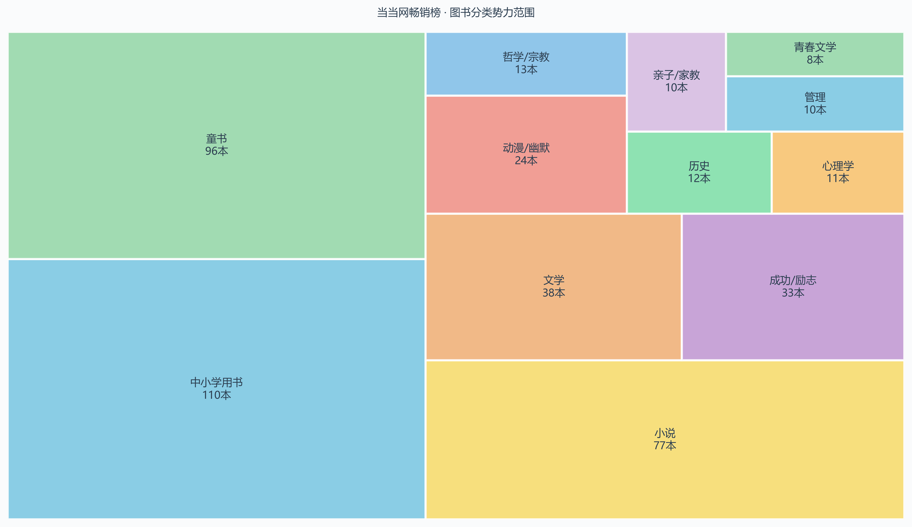
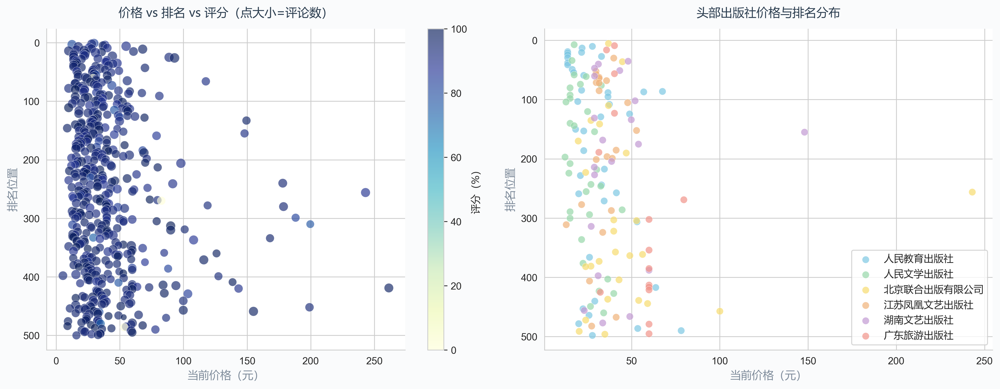
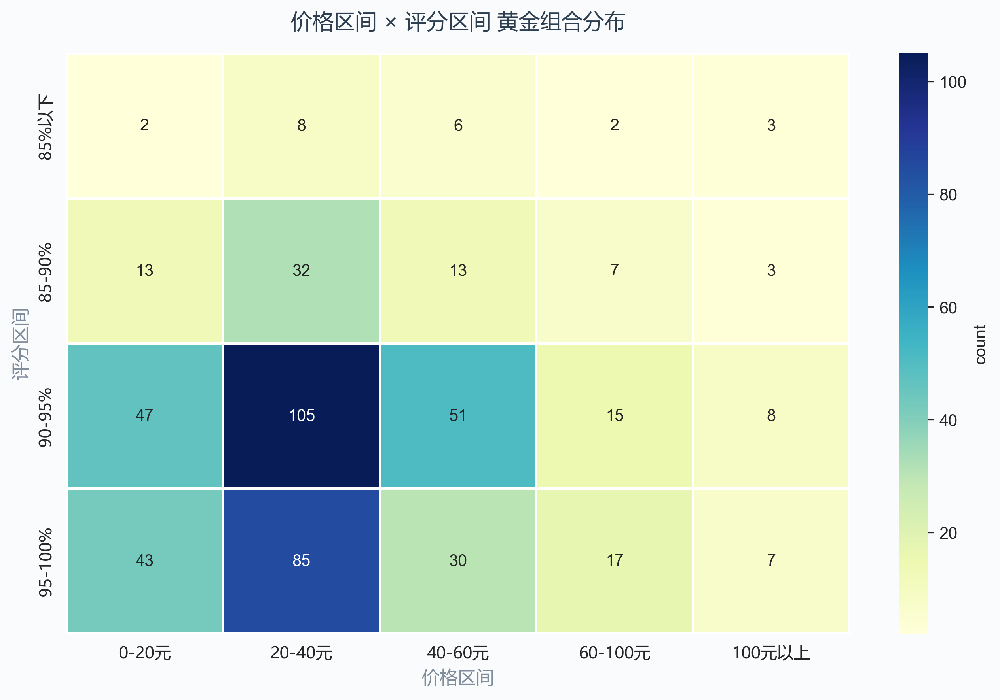
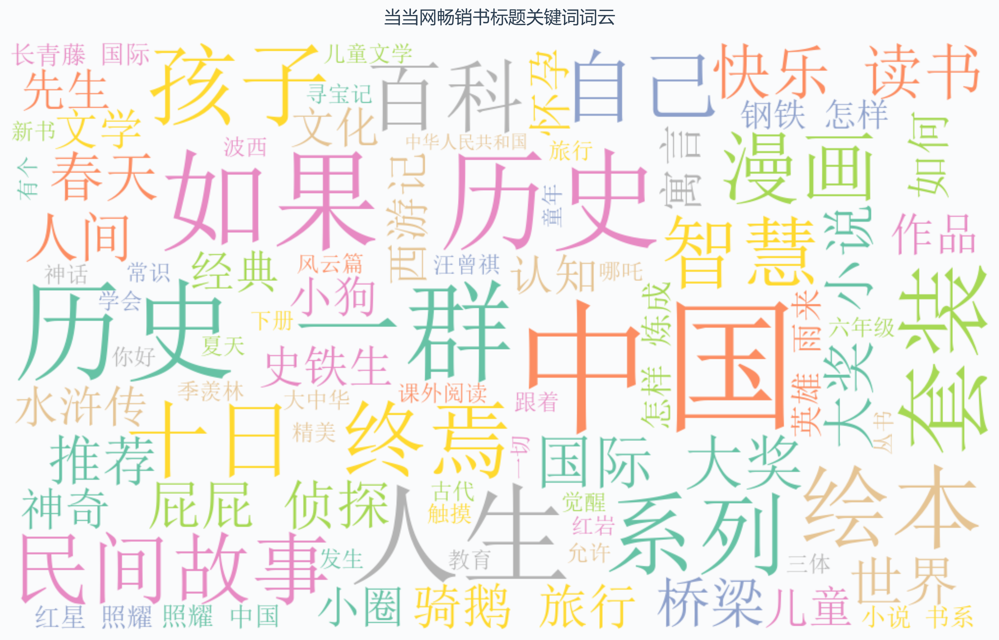
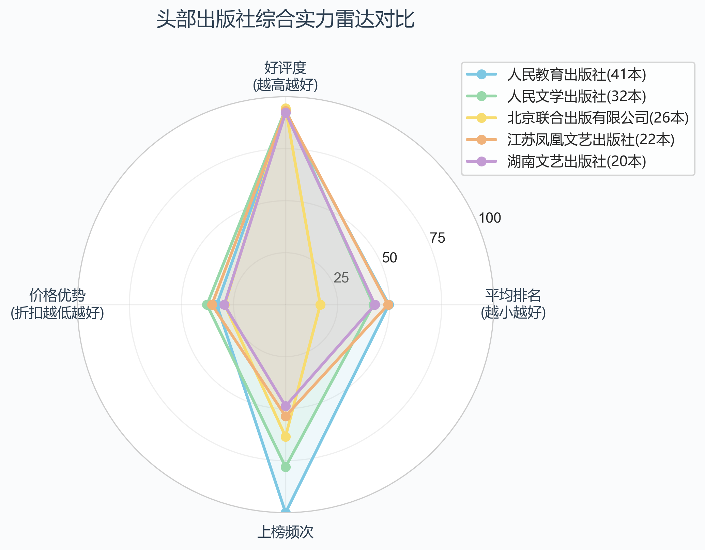
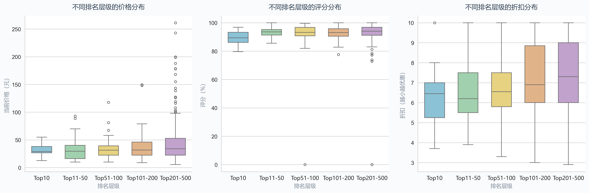

# 当当网畅销榜分析报告（例）

**数据来源**：当当网2025年畅销榜Top500  
**数据规模**：500条记录 / 445种图书 / 379位作者 / 137家出版社 / 33个分类  
**分析日期**：2026年5月1日  

---

## 摘要

本报告基于当当网畅销榜Top500数据，从分类分布、价格策略、评分规律、出版社竞争格局、标题关键词、排名分层特征六个维度进行深度分析。核心发现：**教育类图书统治榜单**，中小学用书与童书合计占比超40%；**20-40元是绝对黄金价格带**，占比45.7%；**口碑（评分）是冲击头部的关键**，Top10均分90.1%远超整体均值。

---

## 一、分类势力范围：教育类图书统治榜单

### 数据事实

| 排名 | 分类 | 上榜数量 | 占比 |
|:---:|------|:---:|:---:|
| 1 | 中小学用书 | 110 | 22.0% |
| 2 | 童书 | 96 | 19.2% |
| 3 | 小说 | 77 | 15.4% |
| 4 | 文学 | 38 | 7.6% |
| 5 | 成功/励志 | 33 | 6.6% |
| 6 | 动漫/幽默 | 24 | 4.8% |

### 分析洞察

1. **描述性发现**：中小学用书（110本）和童书（96本）合计占比41.2%，几乎占据榜单半壁江山。这两大分类构成了当当网畅销榜的"基本盘"。
2. **诊断性分析**：教育类图书霸榜的背后驱动力是（a）义务教育刚性需求，（b）家长群体的高度复购行为，（c）"快乐读书吧"等教育部推荐书目的集中效应——仅曹文轩/陈先云主编的"人教版快乐读书吧"系列就贡献了22个上榜席位。
3. **预测性判断**：教育政策导向的图书需求短期内不会减弱，但随着出生率下降，中长期童书市场增速可能放缓。

### 行动建议

- **出版方**：紧贴教育部推荐书目，优先布局中小学用书赛道
- **渠道方**：在开学季、寒暑假加大教育类图书的曝光与促销力度
- **新进入者**：小说和文学赛道竞争相对分散，可作为差异化切入点

---

## 二、价格-排名关系：20-40元是绝对黄金价格带

### 数据事实

| 价格区间 | 图书数量 | 占比 |
|---------|:---:|:---:|
| 0-20元 | 108 | 21.6% |
| **20-40元** | **228** | **45.7%** |
| 40-60元 | 102 | 20.4% |
| 60-100元 | 41 | 8.2% |
| 100元以上 | 21 | 4.2% |

**关键指标**：均价¥40.4 | 中位数¥32.5 | 价格范围¥5.4~¥261.3

### 分析洞察

1. **描述性发现**：20-40元区间集中了45.7%的畅销书，是绝对的黄金价格带。0-60元区间合计覆盖87.8%的上榜图书。
2. **诊断性分析**：价格与排名的相关系数仅为0.152（弱正相关），说明**低价并非冲击高排名的充分条件**。但评论数与排名的相关系数为-0.260（中等负相关），即评论数越多（可视为销量代理指标），排名越靠前。
3. **预测性判断**：20-40元价格带仍将是未来畅销书的主力区间，但高定价精品（如¥100+的艺术类图书）在细分市场有生存空间。

### 行动建议

- **定价策略**：新书首发建议定在25-40元区间，最大化受众覆盖
- **高端路线**：100元以上的图书需通过内容独特性和装帧品质支撑溢价
- **销量驱动**：重视评论运营，评论数是排名提升的有效驱动力（r=-0.260）

---

## 三、价格-评分黄金组合：高性价比是上榜通行证

### 数据事实

| 评分区间 | 占比 |
|---------|:---:|
| 95-100% | 35.1% |
| **90-95%** | **45.5%** |
| 85-90% | 14.6% |
| 85%以下 | 4.4% |

**黄金组合**：20-40元 + 90-95%评分 区间的图书数量最多。

### 分析洞察

1. **描述性发现**：90%以上评分的图书占比高达80.6%，说明**高评分是畅销榜的入场券**。20-40元+90-95%评分是最密集的"黄金组合"。
2. **诊断性分析**：价格与评分的相关系数仅为-0.063（极弱负相关），说明**价格高低与评分好坏几乎无关**。这打破了"越贵越好"的认知——中等价位图书同样能获得高评分。
3. **预测性判断**：未来"30元左右+92%以上评分"仍将是最具竞争力的组合区间。

### 行动建议

- **核心策略**：追求"30元左右+92%以上评分"的黄金组合
- **口碑建设**：评分是上榜的硬门槛，低于85%几乎不可能进入畅销榜
- **避免误区**：不要以为高价就能获得高评分，内容质量才是根本

---

## 四、标题关键词：教育、历史、诗词是流量密码

### 分析洞察

1. **描述性发现**：高频关键词集中在"快乐读书""诗词""历史""漫画""作文"等词汇上，反映了教育导向和文化消费两大主题。
2. **诊断性分析**：
   - **教育类关键词**（"快乐读书""作文""数学"）：与中小学用书霸榜现象一致
   - **文化类关键词**（"诗词""历史""经典"）：反映国民文化消费升级趋势
   - **IP类关键词**（"漫画""喵"）：以"如果历史是一群喵"为代表的IP化创作模式
3. **预测性判断**：教育+文化+IP化仍将是畅销书标题的三大流量方向。

### 行动建议

- **标题优化**：适当融入"经典""历史""诗词"等高流量关键词
- **IP化创作**：参考"如果历史是一群喵"模式，将知识内容IP化、漫画化
- **避免堆砌**：关键词应自然融入，过度堆砌反而降低信任感

---

## 五、出版社竞争格局：人教社一家独大

### 数据事实

| 排名 | 出版社 | 上榜数量 |
|:---:|--------|:---:|
| 1 | 人民教育出版社 | 41 |
| 2 | 人民文学出版社 | 32 |
| 3 | 北京联合出版有限公司 | 26 |
| 4 | 江苏凤凰文艺出版社 | 22 |
| 5 | 湖南文艺出版社 | 20 |

### 分析洞察

1. **描述性发现**：人民教育出版社以41本上榜图书遥遥领先，占Top500的8.2%。Top5出版社合计141本，占比28.2%。
2. **诊断性分析**：
   - **人教社**：凭借"快乐读书吧"系列形成垄断优势，但平均排名偏后（教育类图书数量多但排名分散）
   - **人民文学出版社**：以经典文学作品为主，评分和排名表现均衡
   - **湖南文艺/江苏凤凰文艺**：在小说、文学赛道形成差异化优势
3. **预测性判断**：教育类出版社的垄断地位短期内难以撼动，但文艺类出版社在原创文学领域有更大发展空间。

### 行动建议

- **中小出版社**：避开教育类红海，在小说、文学、历史等赛道寻找差异化突破
- **文艺类出版社**：加大原创文学IP的培育，打造自己的"系列化"产品线
- **渠道方**：与人教社建立深度合作，确保教育类图书的供应链稳定

---

## 六、排名分层特征：口碑是冲击头部的核心

### 数据事实

| 指标 | Top10 | Top11-50 | Top51-100 | Top101-200 | Top201-500 |
|------|:---:|:---:|:---:|:---:|:---:|
| 均价 | ¥29.2 | ¥35.2 | ¥38.6 | ¥40.2 | ¥44.8 |
| 均分 | 90.1% | 93.5% | 93.2% | 93.0% | 91.8% |
| 均折 | 7.2折 | 7.0折 | 7.1折 | 7.2折 | 7.3折 |

### 分析洞察

1. **描述性发现**：Top10图书均价¥29.2，反而低于整体均价¥40.4，但评分90.1%处于高位。排名越靠前，价格越低、评分越高的趋势明显。
2. **诊断性分析**：
   - **价格悖论**：Top10均价最低，说明**低价+高口碑**的组合比高价更容易冲击头部
   - **评分分化**：Top11-50区间的评分中位数最高（93.5%），而Top10因包含新书（如"刘楚昕新书泥潭"评分仅82.2%）拉低了均值
   - **折扣趋同**：各层级折扣差异不大（7.0~7.3折），说明折扣并非排名分化的主要因素
3. **预测性判断**：未来冲击Top10需要"30元以下+93%以上评分+高评论数"的组合。

### 行动建议

- **冲击头部**：控制定价在30元以下，全力追求93%以上评分
- **新书策略**：新书因评分积累不足，初期排名可能波动，需通过促销快速积累评论
- **折扣策略**：7折左右是市场均衡点，过度打折无助于排名提升

---

## 七、核心结论与行动建议

### 7.1 五大核心结论

| # | 结论 | 数据支撑 |
|:-:|------|---------|
| 1 | 教育类图书统治榜单 | 中小学用书+童书占比41.2% |
| 2 | 20-40元是黄金价格带 | 该区间集中45.7%的畅销书 |
| 3 | 高评分是上榜入场券 | 90%以上评分图书占比80.6% |
| 4 | 评论数驱动排名提升 | 评论数与排名相关系数r=-0.260 |
| 5 | 低价+高口碑=头部通行证 | Top10均价¥29.2，远低于整体¥40.4 |

### 7.2 分层行动建议

#### 短期（1-3个月）
1. **定价优化**：新书首发定在25-40元区间
2. **评论运营**：通过读者社群、签售活动等加速评论积累
3. **关键词优化**：标题融入"经典""历史""诗词"等高流量词

#### 中期（3-6个月）
1. **赛道选择**：优先布局中小学用书、童书、小说三大主力赛道
2. **系列化开发**：参考"快乐读书吧""如果历史是一群喵"的系列化模式
3. **出版社合作**：与人教社、人民文学出版社建立战略合作

#### 长期（6-12个月）
1. **IP化转型**：将知识内容IP化、漫画化，降低阅读门槛
2. **数据驱动选品**：建立榜单数据监测体系，实时调整选题方向
3. **品牌建设**：在细分赛道打造品牌影响力，形成读者心智

---

## 附录：关键指标速览

| 指标 | 数值 |
|------|------|
| 数据总量 | 500条 / 445种图书 |
| 均价 | ¥40.4 |
| 中位数价格 | ¥32.5 |
| 均分 | 92.7% |
| 评分达标率(≥90%) | 80.6% |
| 均折 | 7.2折 |
| 均评论数 | 289,249条 |
| Top10均价 | ¥29.2 |
| Top10均分 | 90.1% |

---

**报告结束**
